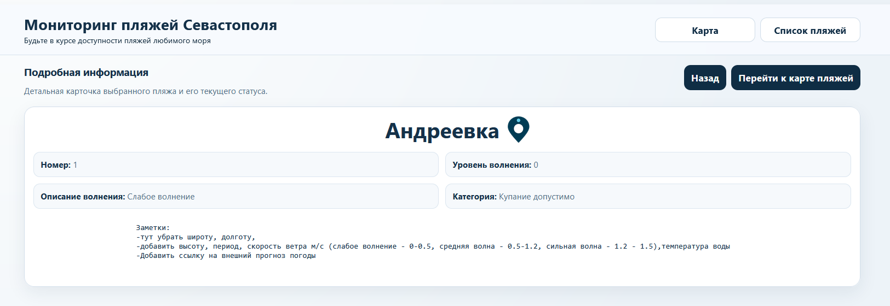

1.
Исправить не центрирующийся карту без обновления страницы
+
2.

-тут убрать широту, долготу,
-добавить высоту, период, скорость ветра м/c (слабое волнение - 0-0.5, средняя волна - 0.5-1.2, сильная волна - 1.2 - 1.5),температура воды

-Добавить ссылку на внешний прогноз погоды
3.
как мне на карте +- масштаба переместить к правой рамке интерфейса? Для правшей это ужасно неудобно нажимать если слева находятся + и -
-
