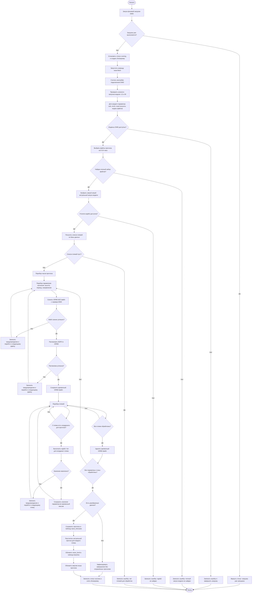
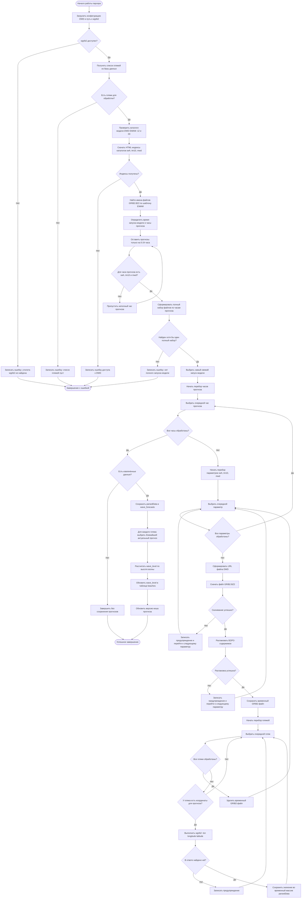

# Блок-схема алгоритма, используемого в ВКР

Алгоритм предназначен для автоматического получения прогноза волнения моря из открытых данных DWD EWAM, привязки значений прогноза к пляжам Севастополя и обновления категории состояния пляжа в информационной системе.

## Краткое описание этапов

1. Система запускает фоновую загрузку и проверяет, не выполняется ли уже другой процесс обновления.
2. Команда `wave:fetch` выбирает последний доступный запуск модели DWD EWAM из каталогов `00` и `12`.
3. Для параметров `swh`, `tm10` и `mwd` выбираются полные наборы файлов прогноза на ближайшие 24 часа.
4. Каждый файл скачивается, распаковывается из `bz2` в `grib2` и обрабатывается утилитой `wgrib2`.
5. Для каждого пляжа по координатам извлекаются значения высоты волны, периода волны и направления волны.
6. Полученные значения сохраняются в таблицу `wave_forecasts`.
7. Для каждого пляжа выбирается ближайший актуальный прогноз, после чего рассчитывается и обновляется уровень волнения `wave_level`.
8. Результат используется интерфейсом карты для отображения состояния пляжей.

## Правило расчёта уровня волнения

В текущей реализации уровень волнения определяется по высоте волны:

| Высота волны | Значение `wave_level` | Интерпретация |
|---|---:|---|
| менее 0.1 м | 0 | слабое волнение |
| 0.1-0.5 м | 2 | небольшое волнение |
| 0.5-1.25 м | 4 | умеренное волнение |
| 1.25-2.5 м | 6 | заметное волнение |
| 2.5-4.0 м | 9 | сильное волнение |
| 4.0 м и выше | 10 | очень сильное волнение |

## Основные программные элементы

- `app/Services/WaveFetchService.php` — запуск фонового процесса, статус, блокировка, журналирование.
- `app/Console/Commands/FetchDwdWaveData.php` — основной алгоритм загрузки, разбора и сохранения прогноза DWD.
- `app/Services/DwdHttpClient.php` — HTTP-клиент для DWD с повторами запросов и диагностикой подключения.
- `app/Services/WaveForecastSelector.php` — выбор актуального прогноза и обновление уровня волнения пляжа.
- `app/Models/WaveForecast.php` — расчёт `wave_level` по высоте волны.

# Блок-схема работы парсера DWD

Эта схема описывает только внутреннюю работу парсера прогноза волнения, который реализован в команде `wave:fetch`.

## Расшифровка обозначений парсера

- `swh` — значимая высота волны, сохраняется как `wave_height`.
- `tm10` — период волны, сохраняется как `wave_period`.
- `mwd` — направление волны, сохраняется как `wave_direction`.
- `GRIB2.BZ2` — сжатый файл прогноза DWD.
- `wgrib2 -lon` — команда извлечения значения из GRIB2-файла по координатам пляжа.
- `parsedData` — временный массив разобранных значений перед записью в базу данных.
