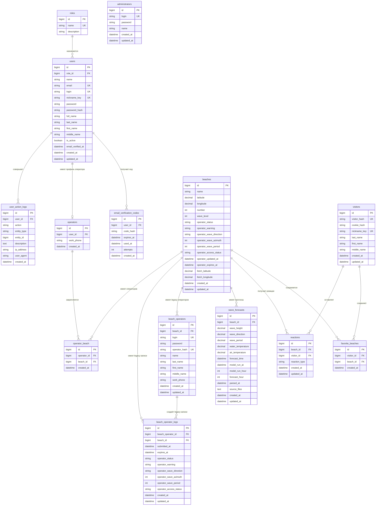

# Актуальная ERD структуры БД

Файл фиксирует текущую структуру после перехода к единой авторизации через `users` + `roles`. Legacy-таблицы `administrators`, `beach_operators` и `beach_operator_logs` пока оставлены для совместимости существующих маршрутов и журналов операторских корректировок.

